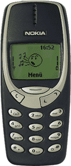

## Assets -
Brawler font= https://fonts.google.com/specimen/Brawler?query=Brawler
Volkhov font= https://fonts.google.com/specimen/Volkhov?query=Volkhov

### Phones

* Click/Hover over V to extend more phone information 
* Price - Phone size - colour - GB size - Camera resolution

### Phone Image - 1 - Samsung Galaxy A12-SMA127FZ 64GB

* Display Size: 6.5 inches PLS TFT LCD Display
* Resolution: 720x1600 pixels (270 ppi density)
* Processor: Mediatek MT6765 Helio P35 (12nm)
* Internal Memory: 64GB
* RAM: 4GB
* Color: Blue
* CPU: Octa-core (4x2.35 GHz Cortex-A53 & 4x1.8 GHz Cortex-A53)
* GPU: PowerVR GE8320
* Network: GSM /HSPA /4G LTE
* SIM: Single SIM (Nano-SIM) or Dual SIM (Nano-SIM, dual stand-by)
* Card Slot: microSDXC (dedicated slot)
* Rear Camera: 48MP+5MP+2MP+2MP Quad Camera
* Front Camera: 8MP
* OS: Android 11
* Battery: 5000mAh with 15W Fast Charging
* Features:Fingerprint (side-mounted), accelerometer, FM radio, RDS, recording

SIM -Dual Sim
SIM Slot -Nano-SIM
OS - Android

https://www.luluhypermarket.com/en-sa/samsung-galaxy-a12-sma127fz-64gb-blue/p/1864430#description-link

### Phone Image - 2  - Samsung Galaxy A52s A528 128GB 5G

* Display Size: 6.5" FHD+ sAMOLED Infinity-O
* Processor: Octa-Core
* Internal Memory: 128GB
* RAM: 8GB
* Main Camera: 64MP + 12M + 5MP + 5MP
* Front Camera: 32MP
* OS: Android 11
* Battery: 4500 mAh

Internal - 128GB
External - microSDXC
RAM - 8GB
Processor - Octa-core, SM7325
SIM - Hybrid
SIM Slot - Nano-SIM
OS - Android 11
Weight - 200g
Size - 6.5 inches
Display Type - FHD+ Super AMOLED, 120HzInfinity-O Display
Resolution - 1080 x 2400 pixels, 20:9 ratio
Primary - 64 MP, f/1.8, 26mm (wide), 12 MP, f/2.2, 123˚ (ultrawide), 5 MP, f/2.4, (macro), 5 MP, f/2.4, (depth)
Secondary - 32 MP, f/2.2, 26mm (wide)
Video Recording - 4K@30fps, 1080p@30fps
Flash - Yes
Network - 5G
WiFi - Yes
Bluetooth - Yes
Port - Type C

https://www.luluhypermarket.com/en-sa/samsung-galaxy-a52s-a528-128gb-5g-awesome-violet/p/1868890#description-link

### Phone Image - 3 - Samsung Galaxy A03s A037FZB 32GB

* Display Size: 6.5" HD+
* Processor: Mediatek 6765
* Internal Memory: 32GB
* RAM: 3GB
* Main Camera: 12M + 2MP + 2MP
* Front Camera: 5MP
* OS: Android 11
* Battery: 5000 mAh

Internal - 32GB
External - microSDXC
RAM - 3GB
Processor - Octa-core, MediaTek MT6765 Helio P35
SIM - Dual Sim
SIM Slot - Nano-SIM
OS - Android 11
Weight - 200g
Size - 6.5 inches
Display Type - HD+ TFT Infinity V-Display
Resolution - 720 x 1600 pixels, 20:9 ratio
Primary - 13 MP, f/2.2, (wide), AF, 2 MP, f/2.4, (macro), 2 MP, f/2.4, (depth)
Secondary - 5 MP, f/2.2
Video Recording - 1080p@30fps
Flash - Yes
Network - LTE
WiFi - YES
Bluetooth - YES
Port - Type C

https://www.luluhypermarket.com/en-sa/samsung-galaxy-a03s-a037fzb-32gb-blue/p/1868883

### Phone - 4 - Apple iPhone 13 Pro Max 256GB Gold

* Display Size: 6.7 inches Super Retina XDR OLED
* Processor: Apple A15 Bionic (5 nm)
* Color: Gold
* Internal Memory:256GB
* RAM:6GB
* Rear Camera: 12MP+12MP+12MP+3D LiDar Scanner
* Front Camera: 12MP
* OS: IOS 15

Internal - 256GB
RAM - 6GB
Chip - A15 Bionic chip|New 6‑core CPU with 2 performance and 4 efficiency cores|New 5‑core GPU|New 16‑core Neural Engine
SIM - Dual SIM (nano‑SIM and eSIM)
SIM Slot - Nano-SIM
OS - iOS 15
Weight - 238g
Other Features - USB-C to Lightning Cable
Size - 6.7 inches
Display Type - Super Retina XDR display with ProMotion
Resolution - 2778‑by‑1284-pixel resolution at 458 ppi
Primary - Pro 12MP camera system: Telephoto, Wide, and Ultra Wide cameras
Secondary - 12MP TrueDepth Camera
Video Recording - Cinematic mode for recording videos with shallow depth of field (1080p at 30 fps)|HDR video recording with Dolby Vision up to 4K at 60 fps|4K video recording at 24 fps, 25 fps, 30 fps, or 60 fps|1080p HD video recording at 25 fps, 30 fps, or 60 fps|720p HD video recording at 30 fps|ProRes video recording up to 4K at 30 fps (1080p at 30 fps for 128GB storage)*|Sensor‑shift optical image stabilization for video (Wide)|Dual optical image stabilization for video (Telephoto and Wide)|3x optical zoom in, 2x optical zoom out
Flash - 6x optical zoom range|Digital zoom up to 9x|Audio zoom|True Tone flash|QuickTake video|Slo‑mo video support for 1080p at 120 fps or 240 fps|Time‑lapse video with stabilization|Night mode Time‑lapse|Cinematic video stabilization (4K, 1080p, and 720p)|Continuous autofocus video|Take 8MP still photos while recording 4K video|Playback zoom|Video formats recorded: HEVC and H.264|Stereo recording
Network - True Tone flash with Slow Sync
WiFi - 5G
Bluetooth - Wi-Fi 802.11 a/b/g/n/ac/6, dual-band, hotspot
NFC - Bluetooth 5.0 wireless technology
Port - NFC with reader mode

https://www.luluhypermarket.com/en-sa/apple-iphone-13-pro-max-256gb-gold/p/1880764

### Phone - 5 - Xiaomi Mi11 Lite 5G 8GB 128GB

* Display Size: 6.55” Dynamic AMOLED 2x display @90Hz refresh rate
* Resolution: 1080 x 2400 pixels (402 ppi density)
* Processor: Qualcomm SM7350-AB Snapdragon 780G (5 nm)
* Internal Memory: 128GB
* RAM: 8GB
* Color: Peach Pink
* CPU: Octa-core (1x2.4 GHz Kryo 670 & 3x2.2 GHz Kryo 670 & 4x1.90 GHz Kryo 670)
* GPU: Adreno 642
* Network: GSM /HSPA /4G LTE /5G
* Hybrid Dual SIM (Nano-SIM, dual stand-by)
* Rear Camera: 64MP+8MP+5MP Triple Camera with Dual-LED Dual-Tone Flash
* Front Camera: 20MP
* OS: Android 11
* Battery: 4250mAh with 33W Fast Charging
* Features: Gorilla Glass 6, IP53 (dust and splash protection), UFS 2.2, 24-bit/192kHz audio, Fingerprint (side-mounted), Fast charging 33W, Power Delivery 3.0, Quick Charge 4+

Internal - 128GB
External - microSDXC (uses shared SIM slot)
RAM - 8GB
Processor - Qualcomm Snapdragon 780G (5 nm)
SIM - Dual Sim
SIM Slot - Nano-SIM
OS - Android 11
Weight - 157g
Other Features - USB Type-C
Size - 6.55”
Display Type - AMOLED 2X @90Hz refresh rate
Resolution - 1080 x 2400 pixels
Primary - 64MP+8MP+5MP Triple Camera
Secondary - 20MP
Video Recording - 4K@30fps, 1080p@30/60/120fps
Flash - gyro-EIS
Network - Dual-LED Dual-Tone Flash
WiFi - GSM/ HSPA/ LTE / 5G
Bluetooth - Yes
NFC - Yes
Port - Yes

https://www.luluhypermarket.com/en-sa/xiaomi-mi11-lite-5g-8gb-128gb-peach-pink/p/1885349

### Phone - 6 - Samsung Galaxy Z Fold 3 F926 256GB 5G

* Main Screen : 6.2" Dynamic AMOLED 2X
* Unfolded Screen : 7.6-inch AMOLED Infinity Flex Display
* Processor: Snapdragon 888
* Internal Memory: 256GB
* RAM: 12GB
* Main Camera: 12MP + 12MP + 12MP
* Front Camera: 4MP
* Cover Camera: 10Mp
* OS: Android 11
* Battery: 4400 mAh

Internal - 256GB
RAM - 12GB
Processor - Snapdragon 888
SIM - Dual Sim
SIM Slot - Nano-SIM
OS - Android 11
Other Features - This is everything you'd want in a premium, durable, 5G smartphone. Then we made it unfold - revealing a massive screen so you can watch, work and play like never before.
Size - 6.2 inches + Unfolded 7.6"
Display Type - 120Hz Dynamic AMOLED 2X
Primary - 12 MP Ultra wide + 12 MP wide +12 MP Telephoto
Secondary - 4 MP, 10 MP Cover Camera
Flash - Yes
Network - 5G
WiFi - Yes
Bluetooth - YES
Port - Type C

### Ipad - 1 - Apple iPad 2021 (9th Generation) 10.2-inch, Wi-Fi, 64GB

* Display Size: 10.2" Retina display with True Tone
* Processor: A13 Bionic chip with Neural Engine
* The 8MP Wide camera on the back of iPad captures sharp, vivid images and video.
* Center Stage makes video calls more engaging by automatically adjusting to keep you centered in the frame. And it lets you create fun videos for posting to popular social apps.
* With all-day battery life, iPad is ready to work or play for as long as you need it.

Display Size - 10.2 Inches
Display Type - Retina display with True Tone
Resolution - 2160-by-1620-pixel resolution at 264 pixels per inch (ppi)
WiFi - Yes
Bluetooth - YES
Port - Lightning
OS - iPadOS 15
Color - Space Gray
Weight - 487g
Internal - 64GB
Processor - A13 Bionic chip with Neural Engine
Primary - 8MP Wide camera
Secondary - 12MP Ultra Wide camera
Video Recording - 1080p HD video recording at 25 fps and 30 fps

### Tablet - 1 - Nokia Tablet T20 -1392 64GB WiFi

* Processor: Unisoc T610 (12 nm)
* Display Size: 10.4” IPS LCD Display
* CPU: Octa-core (2x1.8 GHz Cortex-A75 & 6x1.8 GHz Cortex-A55)
* GPU: Mali G52
* Resolution:1200 x 2000 pixels (224 ppi density)
* Color: Arabic Blue
* Internal Memory: 64GB
* RAM: 4GB
* Main Camera: 8MP with LED Flash
* Front Camera: 5MP
* Network: WiFi Only
* Features: Scratch resistant glass, Splash resistant
* Battery: 8200mAh with 15W fast charging
* OS: Android 11

### Nokia 3310 

Dimensions	113 mm × 48 mm × 22 mm (4.45 in × 1.89 in × 0.87 in)
Mass	133 g (4.7 oz)
Operating system	Series 20
CPU	Texas Instruments MAD2WD1 (based on ARM7TDMI)
Memory	Built-in 1 KB
Battery	Removable
BMC-3 (NiMH) 900 mAh, or
BLC-2 (Li-ion) 1000 mAh
Display	1.5-inch backlit monochrome graphic LCD display
84x48 px, 64 ppi, 5 lines
Sound	Monophonic ringtones
Data inputs	Alphanumeric keypad
SAR	0.96 W/kg (head)