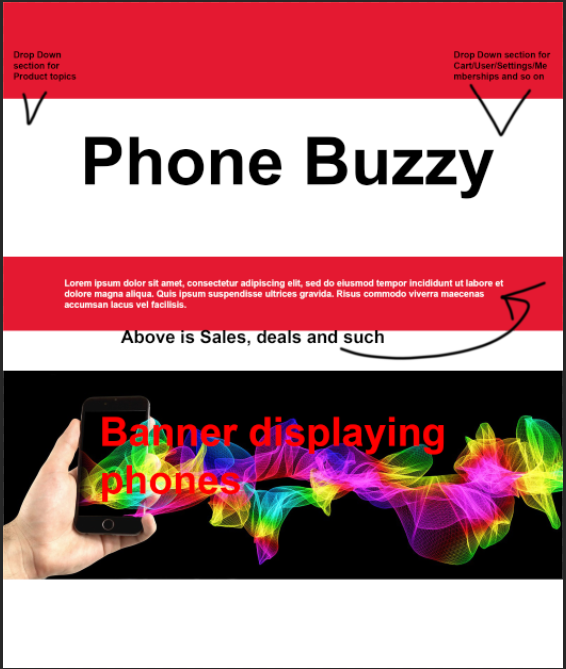

# Planned Design

## Colour Schemes

### Colour scheme one
+ 4e63ae - Calming colour that catches your attention to the content inside, and allows to ignore if not needed without annoyingly glowing to distract you

+ cdcdcd - Bright Grey is to compliment the other calm colours and not be glaringly painful works well as a background colour to let the content pop out

+ 424242 - Works well to blend in the background while popping out to give more attention to content inside

### Colour scheme two
+ #1e6dbc - Nice shade of blue and allows the search bar and other content to popout, easy to spot due to big colour difference

+ #ffffff - Looks professional and works well with other colours

+ #ced4da - Works great as a background colour for products

+ #2a3745 - a Blueish grey description/info box works well with the brighter blue top

## Chosen Colour
with some other colours in between

## Typography 
+ Brawler: Very simple and traditional looking, it was designed for comfortable reading in small sizes, the design concept was shaped by the demands of low quality media and the aesthetic preferences. size 14

+ Volkhov: Looks professional, simplistic and is intended for providing a motivating reading experience. size 14

# Design Evaluation
## Design one

The Design seems simple, easy to navigate, has a good amount of information, loads fast, and seems engaging.

It looks professional, Performs well with minimal amount of bugs,
due to it being engaging, fast loading and easy to navigate, it should have high traffic in income
Due to the professional look it would reinforce the branding.

Code section has Notes which say what section is meant for what area,
Reasonably easy to maintain,
Easy to test, and has the potential to follow HTTPS standards, as mentioned before because its well organised and easy to maintain it can implement codes between the scripts quickly and easily

## Design Two

There is nothing to mention for it, the design is nearly identical due to that i decided to make a third design

## Design Three 

The collapsing drop section on the left is meant to have the products filter etc.
The collapsing drop section on the right is meant to have login/register as well as settings and the cart

the middle section is supposed to contain content such as deals sales and most popular stuff in like a banner/carousel manner

the bottom section is supposed to contain a carousel of New phone banner releases

## Chosen Design

This Design has been chosen as it covers weaknesses of other designs, The navigation is extremely easy and understable as its a navigation bar at the top of the screen, the Product detail is very informative, the phone banner gives an aesthetic pleasure and might entice customers to buy a phone.

The Product section contains 4 cards of phones, more would've been completed had i had more time, the About  section contains the 'Partners' and the Contact description, the User section contains a User form as a way to 'Log in' giving it an interactable ability.

It has been chosen over other designs due to an easier method of navigation, a more aesthetic look, and overall function of the website, as well as the ability to contain much more content than other Designs could've held.

# Conclusion
## Design three has been chosen
Design Three meets the most requirements while it does not meet all standards it is the closest I have, with some work it can easily prove to have all the requirements

It is quick and easy to implement between scripts, although it does not follow (HTTPS) standards as of yet, [requires more work as its still in drafts]. It's easily testable on functionality because the website is pretty small and the test plan helps me not miss any tests. I find it pretty decently documented as i have notes scattered across my code noting which part I'm on, such as what card im on, if im on the navbar, what part of the code i am on etc. etc.
It performs well although it has a couple bugs, in my feedback section i was told a bug which i'd fix by stopping it from stretching and bending, Feedback: "When using the zoom fuction the images and names on the home page go out of proportion and lose most of the text". The feedback suggests the website has a professional look, Feedback: "It has a sleek modern and well polished design" + "The layout is pretty clean, with neat and consistent presentation".
The website has an interactive form but due to it not being finished that stays to be the only thing interactible with.
It loads extremely quick due to the website being very small and not having much content.
The website is very to navigate because it only has a couple navigation destinations which in short is just the products, different pages and cart/user section.
The Product section has a decent amount of information, such as the model name and specs, currently doesn't have any prices as i was pressed on time.

In short, the website currently is not suitable to meet all requirements, while it meets some of them, that is not enough, the section above mentions which have been met, which are close, and which have not been met.
