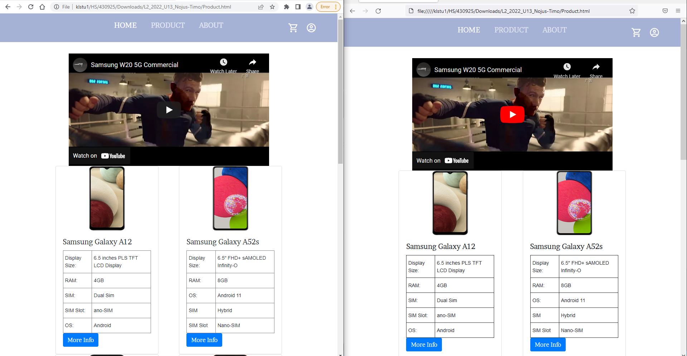
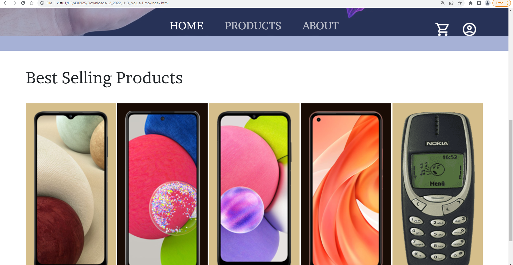
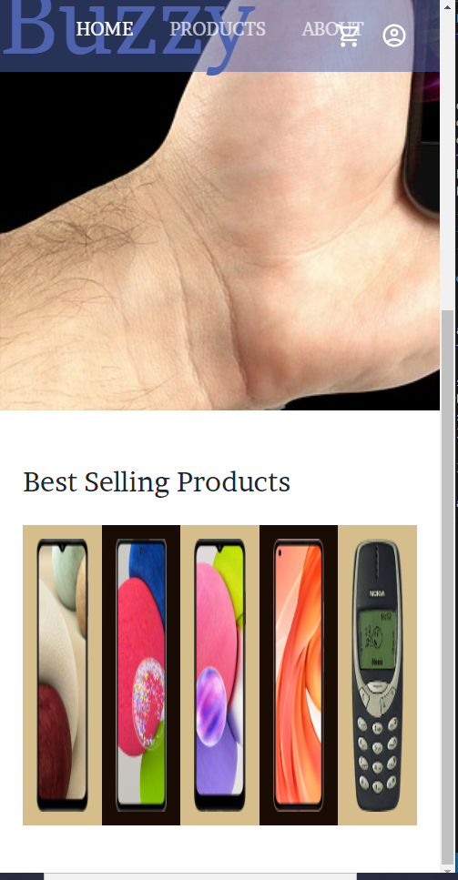

## Navigation 
# Markdown Table
### The table shows where you can go, it helps test the links to help people navigate to the correct location easily

| Start Location -->  | Home | Product | About | Content | Best selling |  Checkout | User| |
|---|---|---|---|---|---|---|---|---|
| Home | &check; | &check; | &check; | &check; |  &check; | &check; | &check; |
| Product | &check; | &check; | &check;  |  &check; |  | &check; | &check; |
| About | &check; | &check;  | &check; | &check;  |  | &check; | &check; |
| Content | &check; |  &check; |  &check; | &check; |  | &check; | &check; |
| Best selling | &check; |  &check; |  &check; |  &check; | &check; |  &check; | &check; |
| Checkout | &check; |  &check; |  &check; |  &check; | |  &check; | &check; |
| User | &check; |  &check; |  &check; |  &check; |  |  &check; | &check; |

# Test Plan

|  Test | Expected | Result |
|---|---|---|
| Function of <b>all</b> links & hyperlinks in the navigation table| User is taken to expected page/site |  |
| Browser Compatability (Chrome, Edge, Firefox etc.) | Site looks the same on each browser, interactivities work on each browser |  |
| Website on Mobile form | Site interactivities and hyperlinks work as it would on PC form |   |
| Appearance at different resolutions | Site looks the same at all resolutions |   |
| Products have the correct details | Products retain the details that match them |  |
| Video & Images working in 2 or more websites | Videos & Images function the same on each browser |  |

# Test sheet

|  Test | Expected | Result |
|---|---|---|
| Function of <b>all</b> links & hyperlinks in the navigation table| User is taken to expected page/site | The links & hyperlinks function according to the navigation table |
| Browser Compatability (Chrome, Edge, Firefox etc.) | Site looks the same on each browser, interactivities work on each browser | Tested browsers resulted to function exactly the same with no errors |
| Website on Mobile form | Site interactivities and hyperlinks work as it would on PC form |  The Phone images in the  home page become stretched as mentioned in the Feedback note, the Navbar gets overlapped with User/Cart image everything else works as expected|
| Appearance at different resolutions | Site looks the same at all resolutions | Site Looks minimally altered in different resolutions  |
| Products have the correct details | Products retain the details that match them | Products retain the correct detail |
| Video & Images working in 2 or more websites | Videos & Images function the same on each browser | Videos function with no error |

Feedback Note: "all the links work" suggesting the links and hypers links function accordingly

Feedback Note: "When using the zoom fuction the images and names on the home page go out of proportion and lose most of the text" suggesting different resolutions has errors to be fixed --- would be fixed by making images+words+containers adapt to size 

Feedback Note: "Plenty of information is provided about the products you're selling" suggesting Products have correct details

+ Note: Mobile form has multiple errors to be fixed

# Website working on 2 or more browsers + Video working in 2 or more websites

# Images not stretching when zoomed in above 200%

* Note: the cart and user go through the contact button + Phones in the best selling squeeze each other stretching them upwards when in mobile form (i would make the navbar adjust size to fit everything without overlaping, and mobile phones resize when squeezed) 

* Note: Images in the "Best Selling Products" stretch when zoomed, Object fit: cover somewhat fixed that by keeping the image consistant but cutting the parts that spill out, currently have no idea how to fix that, i had object fit cover disabled as it cuts off the top and bottom part of nokia 3310

* Note: i would change the other phone specs into table but was pressed on time

* Note: The cards in the product section would have phone descriptions and redirect to their respective pages but was pressed on time